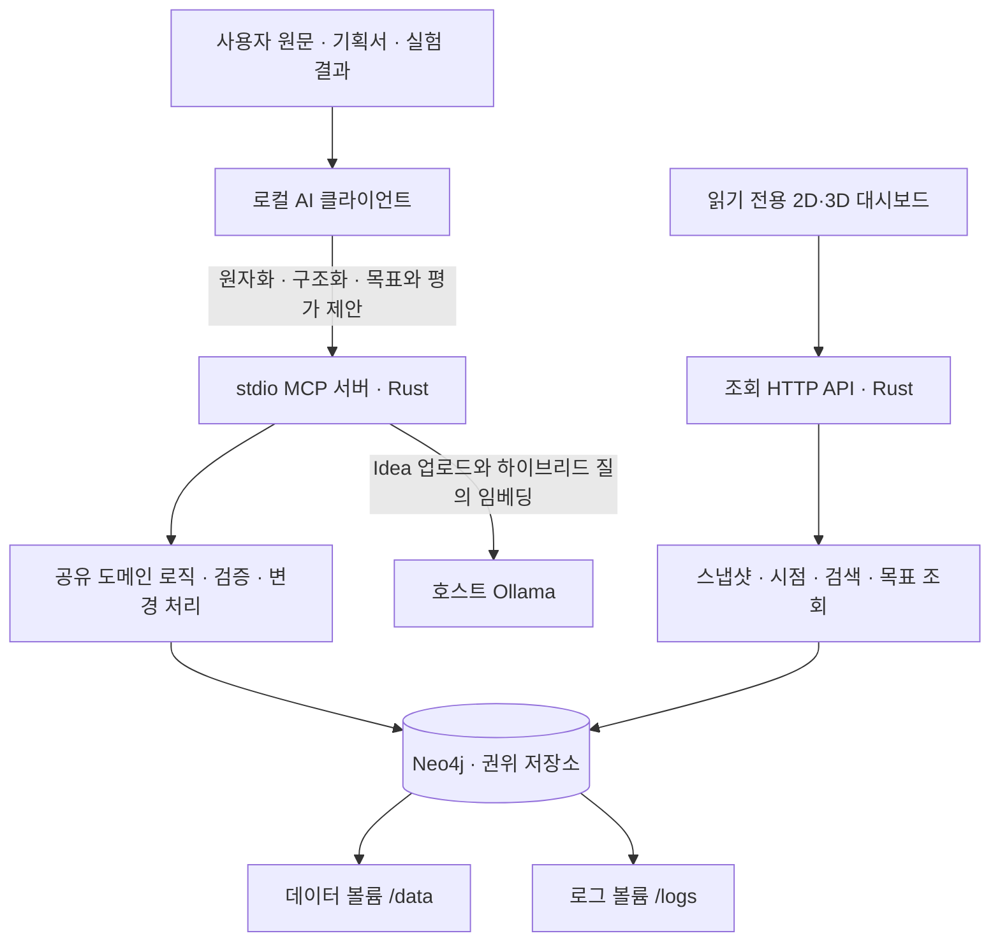
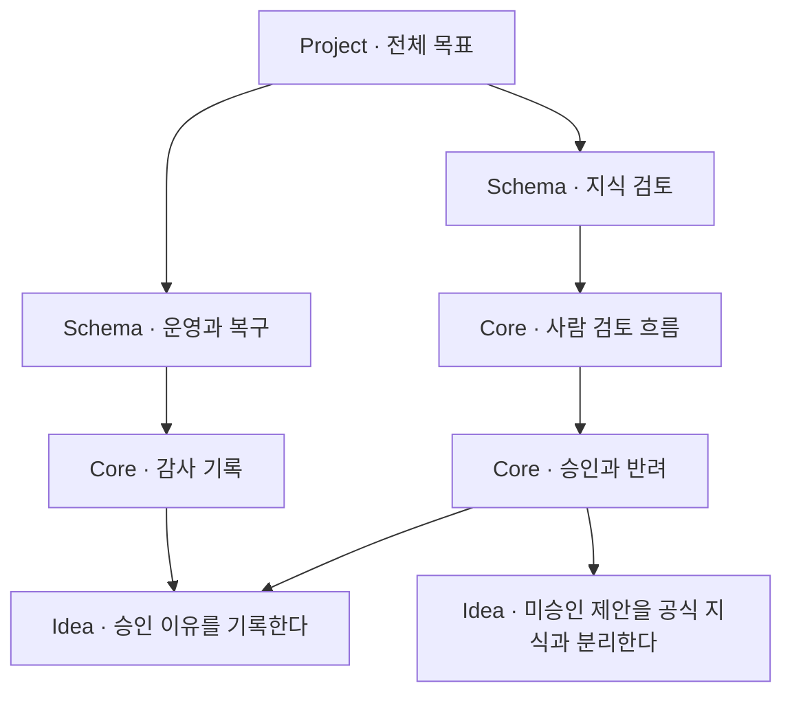
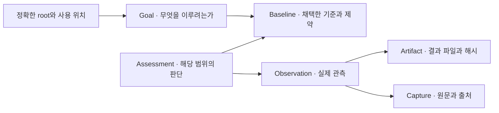
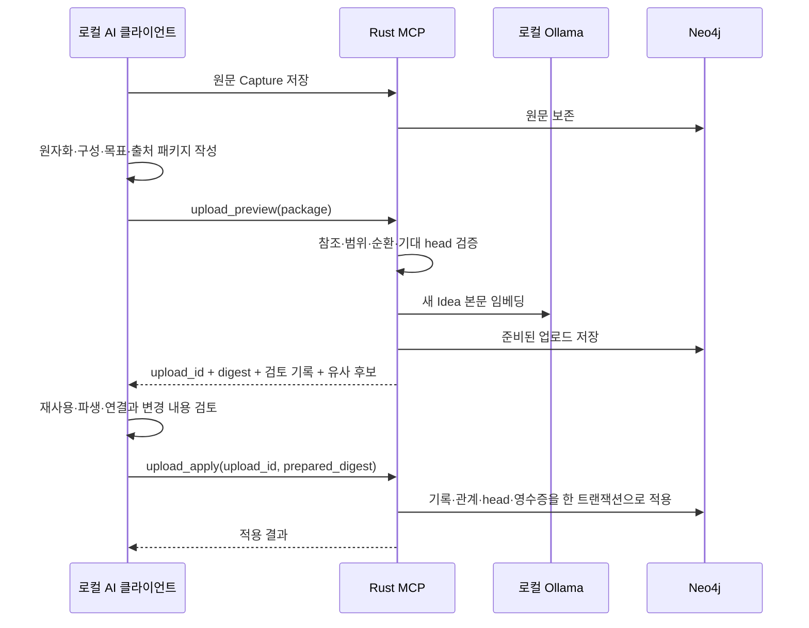
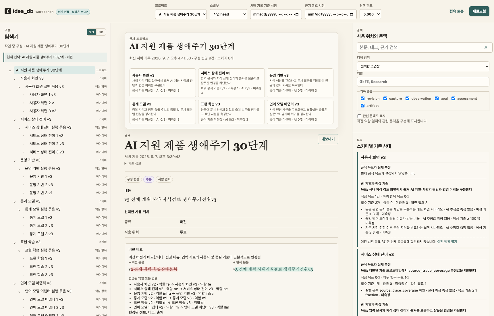
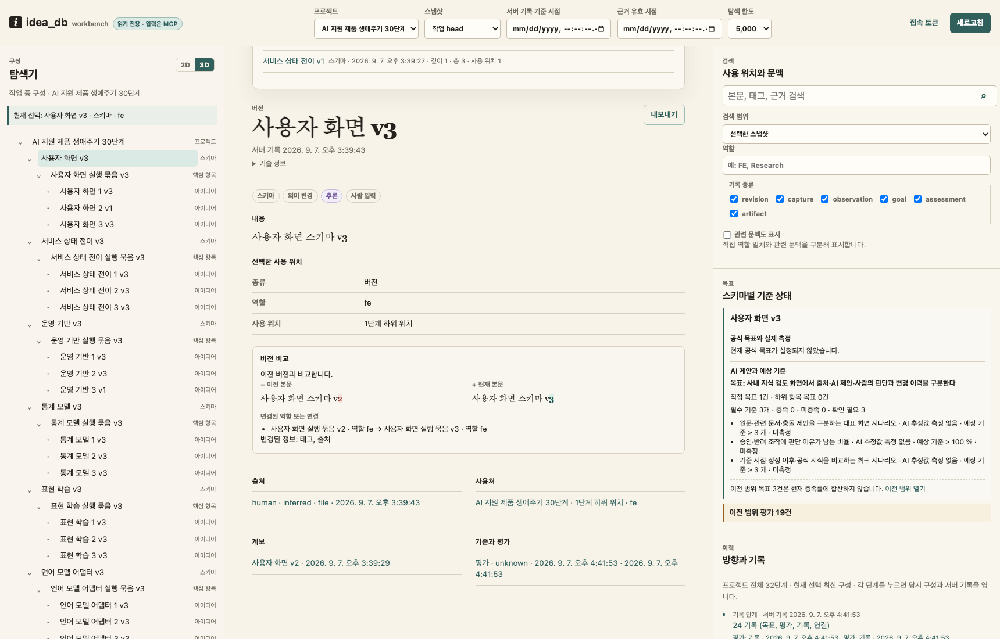
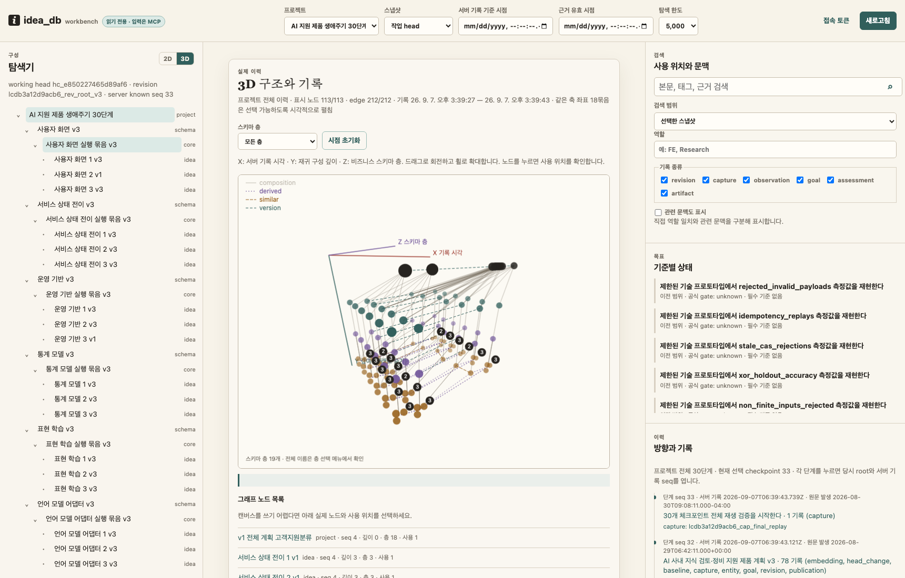

# idea_db

**아이디어를 저장하고, 목표·구성·실험 근거·방향 전환을 시간과 함께 추적하는 그래프 DB입니다.**

하나의 기획이 여러 번 바뀌어도 무엇을 재사용했고, 무엇을 새로 만들었으며, 어떤 근거로 판단했는지 남깁니다. 소프트웨어 개발뿐 아니라 제품 기획, 연구 가설, ML/DL 모델링, 업무 프로세스 설계에도 같은 구조를 사용합니다.

로컬 AI 클라이언트가 원문을 원자 아이디어로 구조화하고 **MCP로 입력**합니다. Rust 애플리케이션이 데이터 계약과 변경을 검증하고, Neo4j가 기록과 관계를 보관합니다. **대시보드는 읽기 전용**이며 2D·3D 탐색, 검색, 버전 비교, 목표와 근거 확인에 사용합니다.

**원자화·요약 구조를 개정했습니다.** 조건과 예외를 보존한 원자 본문에 출처가 있는 AI 요약을 추가하고, 요약+본문을 로컬 임베딩합니다. 공유 아이디어의 목표는 사용 위치별 검색 문맥으로 분리합니다. 기존 본문 전용 벡터와 과거 기록은 유지됩니다. [구조·입력 예시·실험 결과](docs/atomization-and-summary.md)를 확인하세요.

**원자화가 문맥에 도움이 되는지 실제로 비교했습니다.** Grok/Fable의 12개 원문 구조화, MCP 저장 24개 사례, 39개 질문의 문맥 비교와 Neo4j 1,079개 레코드의 재시작·복원 검증을 추가했습니다. 좁은 문맥에서는 그래프 설명을 붙이는 편이 나빠지는 결과도 있습니다. [측정 결과·반례·한계](docs/context-evidence.md), [기계 판독 요약](docs/evidence/20260907-summary.json)을 확인하세요. 재현은 `make evidence-check`이며 생성 모델을 다시 호출하지 않습니다.

> 문서·스크린샷 기준: 2026-09-07, 메인 `5d36550`. Project·Schema·Core의 자체 목표, AI 예상 달성률, 근거 링크, 전체 버전 계보 비교가 구현되어 있습니다. 예상 달성률은 로컬 AI가 현재 기획·구현·검증 근거를 기준으로 작성한 이정표 추정이며, 실제 성능 측정값이나 성공 확률과 분리됩니다.

## 목차

- [무엇을 얻을 수 있나요?](#무엇을-얻을-수-있나요)
- [빠른 설치](#빠른-설치)
- [아키텍처와 Neo4j 선택 이유](#아키텍처와-neo4j-선택-이유)
- [아이디어를 정리하는 방법](#아이디어를-정리하는-방법)
- [목표·평가·시간을 다루는 방법](#목표평가시간을-다루는-방법)
- [MCP로 하는 일](#mcp로-하는-일)
- [첫 예제와 실제 작업 흐름](#첫-예제와-실제-작업-흐름)
- [대시보드 사용법과 스크린샷](#대시보드-사용법과-스크린샷)
- [백업·복원·운영](#백업복원운영)
- [개발·검증과 현재 범위](#개발검증과-현재-범위)

## 무엇을 얻을 수 있나요?

| 궁금한 점 | 저장하거나 조회하는 정보 | 얻는 결과 |
|---|---|---|
| 이 아이디어는 왜 나왔나? | 원문 Capture, 출처 위치, 파생 계보 | 요약에서 원문과 판단 근거까지 역추적 |
| 계획이 바뀌면 무엇을 재사용할 수 있나? | 고정된 Revision, 사용 위치, 역할, 유사 후보 | 재사용·의미 변경·새 항목을 구분하여 검토 |
| 어떤 부분이 달라졌나? | 이전 버전, 구성 슬롯, 변경 이유 | 본문·역할·연결의 변경 확인 |
| 목표에 얼마나 가까운가? | 위치별 Goal, Baseline, Observation, Assessment | 목표 기준과 관측·평가를 같은 맥락에서 확인 |
| 지난주에는 무엇을 알고 있었나? | 서버 기록 시각과 사건 발생 시각 | 당시 알 수 있었던 구성과 근거 재현 |
| 이 실험 결과를 믿을 수 있나? | 실행 방법, 코드·데이터·모델·설정 버전, 결과 Artifact | 성공·실패·미관측을 구분하고 재현 자료 추적 |

예를 들어 고객 문의 분류 제품을 장애 분석 도구로 바꾸고, 다시 사내 지식 검토 제품으로 전환할 수 있습니다. 화면과 모델은 크게 바뀌어도 사람 승인, 출처 보존, 감사 기록 같은 아이디어는 재사용할 수 있습니다. 이전 제품에서 성공했던 실험을 새 목표의 달성 근거로 자동 간주하지 않는 것이 이 DB의 중요한 원칙입니다.

## 빠른 설치

### 1. 준비 사항

기본 실행 경로는 **Docker Desktop + Compose v2**입니다. 저장소와 다음 도구가 필요합니다.

| 도구 | 필요한 작업 |
|---|---|
| Docker / Compose v2 | Rust 서비스와 Neo4j가 들어 있는 이미지 빌드·실행 |
| `make`, `openssl` | 실행 명령과 최초 로컬 암호 생성 |
| 호스트 Ollama + `embeddinggemma:300m` | Idea 업로드 임베딩, MCP 하이브리드 검색 |
| stdio MCP를 지원하는 AI 클라이언트 | 원문 이해, 원자화, 목표·평가 제안, 업로드 검토 |
| Python 3 | 선택 사항: 예제 CLI, 백업 클라이언트, 검증 스크립트 |

Rust와 Python을 **DB 런타임으로 호스트에 설치할 필요는 없습니다**. 생성형 모델 구독은 AI 클라이언트가 사용하고, 임베딩은 별도의 로컬 Ollama 모델을 사용합니다. Ollama 설치는 [공식 빠른 시작](https://docs.ollama.com/quickstart)을 참고하세요.

저장소는 [chee0Yoon/idea_db_poc](https://github.com/chee0Yoon/idea_db_poc)입니다. 소스를 받은 뒤 저장소 루트에서 명령을 실행합니다. Windows에서는 아래 POSIX 셸 명령을 실행할 수 있는 환경이 필요하며, 현재 실검증 환경은 macOS Docker Desktop입니다.

### 2. 임베딩 준비와 실행

Ollama 앱 또는 서버가 실행 중인 상태에서:

```sh
ollama pull embeddinggemma:300m
ollama list
```

검증에 사용한 모델 파일은 약 622 MB입니다. 최초 다운로드와 Docker 빌드에는 네트워크가 필요합니다.

저장소 루트에서:

```sh
make up
docker compose ps
curl --fail http://127.0.0.1:8080/health/ready
```

`make up`은 다음 작업을 수행합니다.

1. `.env`가 없으면 임의의 Neo4j 암호와 기본 포트 8080을 생성합니다. 기존 `.env`는 보존합니다.
2. Docker 이미지 안에서 Rust 실행 파일을 빌드합니다.
3. Neo4j와 Rust 서비스를 시작하고 실제 DB 조회가 가능한지 readiness를 확인합니다.
4. `/data`와 `/logs`를 각각 이름 있는 Docker 볼륨에 연결합니다.

[로컬 대시보드](http://127.0.0.1:8080)를 엽니다. **새 설치는 빈 DB로 시작합니다.** 문서의 스크린샷이나 30단계 테스트 Project가 자동으로 생성되지는 않습니다. 첫 자료는 [첫 예제](#첫-예제와-실제-작업-흐름)로 넣습니다.

### 3. AI 클라이언트에 MCP 등록

클라이언트의 MCP 설정에 다음 서버를 추가합니다. `command`를 실제 저장소의 **절대 경로**로 바꾸세요. 설정 위치와 재연결 방법은 사용 중인 클라이언트에 따릅니다.

```json
{
  "mcpServers": {
    "idea_db": {
      "command": "/absolute/path/to/idea_db_neo4j/scripts/idea-db-mcp",
      "args": []
    }
  }
}
```

[실행기](scripts/idea-db-mcp)는 자신의 경로에서 저장소를 찾은 뒤 `docker compose exec -T`로 컨테이너의 MCP 프로세스를 실행합니다. 작업 디렉터리를 별도로 지정할 필요는 없습니다. `make up`으로 서비스를 먼저 시작해야 합니다.

연결 후 AI 클라이언트에 다음과 같이 요청합니다.

> idea_db의 MCP 도구와 입력 계약 리소스를 확인하고, 현재 프로젝트 목록을 조회해 줘. 이후 입력에는 이 저장소의 `skills/idea-db-input/SKILL.md`를 적용해 줘.

서버는 `idea-db://contracts/mcp-intake`와 `idea-db://contracts/domain-api` 리소스도 제공합니다. MCP stdout은 프로토콜용이므로 일반 로그를 섞지 않습니다. 공식 Rust SDK `rmcp 3.2.0`의 stdio 서버를 사용하며, 대시보드 URL 자체가 MCP 접속 주소는 아닙니다.

### 4. 설정과 종료

| 설정 | 기본값 / 용도 |
|---|---|
| `NEO4J_PASSWORD` | 최초 `.env`에 생성. 같은 데이터 볼륨을 쓰는 동안 보존 |
| `IDEA_DB_PORT` | `8080`; 호스트에 공개할 웹/API 포트 |
| `IDEA_DB_TOKEN` | 선택적 HTTP API bearer token; 설정했다면 대시보드의 ‘접속 토큰’에서 입력 |
| `IDEA_DB_EMBEDDING_URL` | `http://host.docker.internal:11434`; 컨테이너에서 호스트 Ollama로 연결 |
| `IDEA_DB_EMBEDDING_MODEL` | `embeddinggemma:300m` |

`.env`를 수정한 경우 `make up`으로 해당 설정을 반영합니다. `.env`의 암호만 바꾸는 것은 기존 Neo4j 암호 변경 절차가 아닙니다.

```sh
make logs   # 컨테이너 stdout/stderr 확인
make down   # 컨테이너 종료. 데이터·로그 볼륨은 보존
```

Linux Docker Engine은 호스트 Ollama의 이름 해석과 리슨 주소를 별도로 구성해야 할 수 있습니다. 기본 Compose는 Docker Desktop의 `host.docker.internal` 경로를 기준으로 검증했습니다. 호스트에서 모델이 보여도 컨테이너가 연결할 수 있는지는 별개입니다. Ollama 리슨 설정은 [공식 FAQ](https://docs.ollama.com/faq)를 참고하세요.

## 아키텍처와 Neo4j 선택 이유

### 구성 요소의 책임



| 계층 | 하는 일 | 구현 위치 |
|---|---|---|
| 로컬 AI | 문서 이해, 원자화, 재사용 판단, 목표·평가 제안 | [입력 스킬](skills/idea-db-input/SKILL.md) |
| MCP | 도구·리소스 제공, 입력 검증·미리보기·적용·복원 | [src/mcp.rs](src/mcp.rs) |
| Rust 도메인 | 자료형, 참조·범위·순환 검사, 변경·멱등성 | [model](src/model.rs), [validate](src/validate.rs), [mutation](src/mutation.rs) |
| 검색·임베딩 | 모델 프로필 고정, 후보 검색, 업로드 준비 | [ingest](src/ingest.rs), [staging](src/staging.rs), [query](src/query.rs) |
| 저장·복구 | Neo4j 트랜잭션, 노드·관계, export/import | [store](src/store.rs), [neo4j](src/neo4j.rs), [backup](src/backup.rs) |
| UI | 탐색·검색·비교·관측 확인 | [static](static/) |

기본 standalone 이미지는 **하나의 컨테이너 안에서 Neo4j와 Rust 웹 서비스를 실행**합니다. MCP 연결 시에는 같은 이미지의 별도 Rust MCP 프로세스가 실행되며 공통 도메인 코드를 사용합니다. 생성형 모델과 임베딩 모델은 이미지에 포함되지 않습니다.

Neo4j 접속 포트는 기본 standalone 컨테이너의 loopback에 바인딩됩니다. Compose는 웹/API 포트만 호스트 `127.0.0.1`에 노출합니다. 필수 프로세스가 종료되면 컨테이너도 실패 상태로 종료됩니다.

### 왜 Neo4j인가?

이 프로젝트에서는 ‘문서 한 개를 저장한다’보다 다음 관계를 보존하는 일이 중요합니다.

- 하나의 Idea가 여러 Core·Schema에서 사용되는 관계
- v1 아이디어에서 v2가 파생되거나, 특정 위치만 새 버전으로 교체되는 관계
- 목표 → 기준선 → 평가 → 관측 → 원문·실험 산출물로 이어지는 관계
- 유사·모순·의존·영향이라는 서로 다른 연결

Neo4j는 노드·타입이 있는 방향 관계·속성으로 구성하는 **property graph** 모델을 제공합니다. 이 구조가 위 도메인과 잘 맞는다는 것이 선택 이유입니다. [Neo4j 그래프 개념](https://neo4j.com/docs/getting-started/appendix/graphdb-concepts/)

| 선택지 | 이 MVP에서의 판단 |
|---|---|
| 관계형 DB | 구현 가능하지만 재귀 사용 위치·버전 계보·다양한 연결을 응용 계층에서 일관되게 다루는 설계가 필요 |
| Neo4j | 관계를 직접 저장하고 기존 트랜잭션·저장 기능 위에서 도메인 규칙을 검증하기에 적합 |
| 자체 그래프 저장 엔진 | 스키마 설계와 함께 저장·동시성·복구까지 검증해야 하므로 현재 핵심 과제의 범위가 커짐 |

이는 **이 프로젝트의 설계 판단**이며 Neo4j가 모든 질의에서 더 빠르다는 벤치마크 결론은 아닙니다. 현재 구현은 소규모 그래프를 일관된 상태로 읽어 Rust에서 탐색·필터·검색 순위를 계산합니다. Neo4j의 대규모 벡터 인덱스나 모든 그래프 분석 기능을 사용한다고 가정하면 안 됩니다.

Rust는 API·MCP·검증·조회 로직에 사용합니다. Neo4j의 저장 엔진을 Rust로 다시 작성한 것은 아닙니다. 향후 팀 운영의 속도·안정성은 실제 워크로드, 동시성, 복구·권한 설계를 함께 측정해야 합니다.

### Neo4j 안에는 어떻게 저장되나?

각 도메인 기록은 `Record` 노드입니다. 응용 ID, 종류, 서버 sequence, 기록 시각과 직렬화한 본문을 보관하고, 본문에 정의된 참조를 `CONTAINS`, `DERIVED_FROM`, `FOR_GOAL`, `AGAINST_BASELINE`, `EVIDENCE` 같은 관계로 투영합니다.

운영 기록은 별도로 둡니다. `IdeaDbMeta`는 전역 sequence와 잠금, `Receipt`는 멱등 요청 결과, `IdeaDbUpload`는 미리보기·적용 상태를 보존합니다. 각 Project는 **논리적 범주**이며 Project마다 별도의 물리 Neo4j DB를 만드는 구조는 아닙니다.

## 아이디어를 정리하는 방법



| 단위 | 정의 | 예 |
|---|---|---|
| Project | 전체 작업을 묶는 가장 큰 논리적 범주 | 사내 지식 검토 제품 |
| Schema | 상위를 나누는 업무 단위 | 문서 수집, 검토, 검색, 복구 |
| Core | 목적을 가진 구성 묶음. 하위 Core를 재귀적으로 포함 | 검토 흐름 → 승인/반려 → 권한 판정 |
| Idea | 독립적으로 설명·검토·교체·재사용할 수 있는 최소 의미 단위 | 반려할 때 이유를 기록한다 |

`middle`이라는 고정 계층은 없습니다. Core 깊이가 늘어나는 방식입니다. 모델은 재귀적이지만 MVP 탐색에는 깊이 32 등 자원 한도가 있습니다.

**원자화는 문장을 무조건 짧게 자르는 작업이 아닙니다.** “실패가 5번이면 30초 잠그되 관리자 복구는 허용한다”처럼 조건·수치·예외가 함께 의미를 만드는 규칙은 그 관계를 보존해야 합니다. 화면에 표시하는 일과 BE가 잠금을 강제하는 일이 독립적으로 구현·검증된다면 별도 Idea로 나누고 연결합니다.

아직 판단하기 어려운 내용은 원문 Capture와 Candidate로 보관합니다. 자식이 없다는 이유만으로 원자화 완료로 취급하지 않습니다.

### 동일한 아이디어와 사용 위치

Entity는 의미의 정체성이고 Revision은 고정된 내용입니다. 부모 Revision의 `slots`는 자식의 **정확한 Revision**을 가리킵니다.

```text
Project revision A
└─ schema: login
   ├─ core: frontend → policy revision 1  [역할: FE]
   └─ core: backend  → policy revision 1  [역할: BE]
```

두 위치가 같은 정책을 재사용해도 목표와 평가 맥락은 다를 수 있습니다. 사용 위치는 `root_revision_id + slot_path`로 구분합니다. 한 경로를 수정하면 그 경로의 조상만 새 Revision으로 만들고, 다른 경로와 과거 스냅샷은 유지합니다.

FE·BE·Data·DB·Infra·ML·DL·LLM·기획 같은 R&R은 사용 위치에 붙는 태그입니다. 업무 Schema와 R&R을 동일한 개념으로 고정하지 않습니다. 예제에서 역할별 Schema를 만든 것은 해당 시나리오의 선택입니다.

### 버전과 연결

| 변경 | 기록 방식 |
|---|---|
| 오탈자 정정 | 같은 의미의 새 Revision과 교정 사유 |
| 의미 변경 | 새 Entity/Revision과 명시적 파생 관계 |
| 여러 Idea의 조합 변경 | 새 부모 Revision의 슬롯 구성 |
| 사용 중단 | 새 구성에서 슬롯 제외. 기존 기록은 보존 |
| 유사 후보 발견 | 후보로 검토한 뒤 명시적 유사 연결 |
| 영향·모순·의존 판단 | 관계 종류와 범위·근거를 분리하여 기록 |

유사도는 동일성, 재사용 가능성, 인과 영향도 또는 목표 달성률이 아닙니다. 실제 채택 여부는 로컬 AI와 사용자의 문맥 검토를 거쳐 기록합니다.

## 목표·평가·시간을 다루는 방법



Project·Schema·Core·Idea의 사용 위치에 각각 목표를 둘 수 있습니다. 예를 들어 Project 목표는 “출처를 보존하며 지식을 검토한다”, Schema 목표는 “잘못된 상태 전이를 차단한다”, Core 목표는 “승인 권한과 이유를 검증한다”가 됩니다. 하위 Idea가 모두 존재한다고 상위 목표가 자동 달성되는 것은 아닙니다.

| 기록 | 질문 | 예 |
|---|---|---|
| Goal | 무엇을 이루려는가? | 허용되지 않은 상태 전이를 차단한다 |
| Criterion / Baseline | 어떤 기준으로 판단할 것인가? | 정의한 거절 시나리오에서 차단 비율 100% |
| Observation | 실제로 무엇이 관측되었는가? | 고정 fixture 10건 중 9건 차단 |
| Assessment | 이 근거가 현재 목표를 충족하는가? | 기준 미충족, 현재 root/경로/근거 cutoff에 한정 |

AI 제안은 `ai_proposed`, 공식 판단은 `official`로 구분합니다. 근거가 없으면 `unknown`이며 실제 측정값을 만들어 넣지 않습니다. 기준선이 바뀌거나 제품 문맥이 달라지면 이전 평가를 그대로 승계하지 않습니다.

**달성률 표시:** Project·Schema·재귀 Core마다 자체 목표를 두고, 연결된 필수 기준을 현재 아이디어·기획·구현·검증 근거와 대조한 AI 예상 달성률을 표시합니다. 모든 필수 기준에 유효한 추정이 있을 때만 같은 목표 안에서 평균하며, 자식 개수나 자식 점수를 부모 달성률로 자동 평균하지 않습니다. 목표 임계값, 실제 관측값, AI 이정표 추정, 성공 확률은 서로 다른 정보로 다룹니다. 상세 계약과 수용 결과는 [API 계약](docs/api.md)과 [검증 기록](docs/validation.md)을 기준으로 확인하세요.

시간도 두 축으로 구분합니다.

- **서버 기록 시각 / `known_at`, `known_seq`:** DB가 언제 그 사실을 알았는가?
- **사건 발생 시각 / `effective_at`:** 관측이나 근거는 실제 언제 발생했는가?

8월 10일에 발생한 실험을 8월 15일에 입력했다면, 8월 12일 당시 DB의 지식 상태에는 나타나지 않습니다. 특정 과거 상태에서 미래에 생긴 관측·평가를 사용하지 않도록 범위와 cutoff를 검사합니다.

## MCP로 하는 일

MCP는 로컬 AI가 DB 기능을 도구로 호출하는 입력 창구입니다. 원자화는 AI가 수행하고, MCP/DB는 구조를 검증하고 저장합니다. DB가 원문을 자동 분해하거나 목표를 추론하는 생성형 서비스를 내장한 구조가 아닙니다.

| 작업 | MCP 도구 |
|---|---|
| 현재 상태·기록·원문 조회 | `idea_state`, `idea_record`, `idea_captures` |
| 구성·사용 위치·목표 조회 | `idea_snapshot`, `idea_occurrences`, `idea_goals` |
| 역할·시점·문맥 검색 | `idea_search` |
| 원문 먼저 보관 | `idea_capture_create` |
| 패키지 계약 확인 | `idea_package_validate` |
| 임베딩·유사 후보와 변경 내용 미리보기 | `idea_upload_preview` |
| 검토한 변경 원자적 적용 | `idea_upload_apply` / `idea_package_apply` |
| 특정 사용 위치 교체 | `idea_occurrence_replace` |
| 적용하지 않을 미리보기 철회 | `idea_upload_discard` |
| 프로젝트 내보내기 / 빈 DB 복원 | `idea_export`, `idea_import` |

### 한 번의 입력이 처리되는 과정



같은 업로드 ID 재시도는 멱등적으로 처리합니다. 기준 head가 달라졌다면 무작정 다시 적용하지 않고 최신 상태에서 새 패키지를 검토합니다. 잘못된 참조·순환·출처·범위는 거절하고, 도메인 기록의 일부만 적용하지 않습니다.

임베딩 생성에 실패하면 성공으로 가장하거나 어휘 임베딩으로 대체하지 않습니다. 원문은 남아 있으므로 입력을 보완해 다시 preview할 수 있습니다. 유사 후보는 자동 병합되지 않습니다.

### 검색이 이루어지는 방식

조회할 Project·root·시점·역할로 후보를 좁히고, 어휘 점수와 동일한 모델 프로필의 벡터 유사도 순위를 결합합니다. 엄격한 역할 일치와 관련 문맥은 구분하여 반환합니다. 모델 이름뿐 아니라 manifest digest·차원·입력 형식을 기록하여 서로 다른 임베딩 공간을 섞지 않습니다.

MCP 하이브리드 검색에는 Ollama가 필요합니다. 대시보드의 어휘 검색은 모델 없이 동작합니다. 자세한 호출 인자와 결과 계약은 [MCP 입력 가이드](docs/mcp-intake.md), [API 문서](docs/api.md)에 있습니다.

## 첫 예제와 실제 작업 흐름

### 1. 준비된 로그인 예제 넣기

이 예제는 원자화가 끝난 fixture입니다. 사용자 문서를 AI가 읽는 과정을 대신 증명하지는 않지만, **미리보기 → 검토 → 적용 → 조회**를 재현할 수 있습니다. 새 DB 또는 이 예제 ID가 없는 DB에서 실행하세요.

저장소 루트에서 Python 3과 실행 중인 Docker/Ollama를 사용합니다.

```sh
export IDEA_DB_MCP_COMMAND_JSON='["docker","compose","exec","-T","idea-db","idea-db-mcp"]'
python3 scripts/idea-db-client.py state
python3 scripts/idea-db-client.py validate examples/01_software_login.json
(
  set -C
  python3 scripts/idea-db-client.py preview examples/01_software_login.json > /tmp/idea-db-login-preview.json
)
```

`/tmp/idea-db-login-preview.json`의 `review_records`, `mappings`, `validation`을 검토합니다. 같은 이름의 기존 파일이 있다면 새 경로를 사용해 이전 결과를 보존하세요. 검토한 뒤 **원본 package 전체 대신 다음 두 필드만** apply 파일에 넣습니다.

```json
{
  "upload_id": "preview에서 반환한 upload_id",
  "prepared_digest": "preview에서 반환한 prepared_digest"
}
```

위 JSON을 `/tmp/idea-db-login-apply.json`에 실제 반환값으로 저장한 뒤:

```sh
python3 scripts/idea-db-client.py apply /tmp/idea-db-login-apply.json
```

[로그인 예제 Project](http://127.0.0.1:8080/?project=proj_login_example)를 엽니다. [예제 02](examples/02_login_occurrence_replace.json)는 사용 위치 교체, [예제 03](examples/03_modeling_hypothesis.json)과 [04](examples/04_modeling_new_baseline.json)는 모델링 가설·기준선 변경, [예제 05](examples/05_qualitative_planning.json)는 정성적 기획, [예제 06](examples/06_invalid_cycle.json)은 순환 거절을 다룹니다. 교체 예제는 CLI `replace`, 일반 패키지는 `preview`와 `apply` 경로를 사용합니다.

### 2. 내 기획서 넣기

MCP를 연결한 AI 클라이언트에 원문을 주고 다음처럼 요청합니다.

> 이 문서를 새 Project로 정리해 줘. 원문을 먼저 보존하고, 업무 Schema와 재귀 Core를 구성해 독립적으로 검증 가능한 Idea까지 나눠 줘. FE·BE·Infra·ML·DL·LLM 역할은 사용 위치에 붙여 줘. 원문 요구사항마다 연결된 Idea 또는 보류 이유를 남겨 줘. 각 Project·Schema·Core의 목표와 수용 기준을 별도로 제안하고 AI 제안임을 표시해 줘. 기존 유사 아이디어는 자동 병합하지 말고 preview 결과에서 재사용·파생 여부를 검토해 줘.

AI는 [입력 스킬](skills/idea-db-input/SKILL.md)과 MCP 계약에 맞는 패키지를 작성합니다. 새 Idea가 왜 독립 단위인지, 원문 조건·예외가 빠지지 않았는지, 목표가 하위 항목 수에만 의존하지 않는지 검토한 뒤 적용합니다.

### 3. 개발과 실험 기록 추가

실험 후에는 “테스트 성공”만 적는 대신 대상 Idea Revision, 실행 방법, 코드·모델·데이터·설정 버전, 관측값, 결과 파일과 해시를 보관합니다. 잘못된 입력을 기대대로 거절한 결과와 프로그램 자체가 실패한 결과를 구분합니다. 공식 평가에는 그 평가 범위에 맞는 실제 근거를 사용합니다.

### 4. 기획을 변경하고 이전 아이디어 재사용

> 제품 목표가 장애 대응에서 사내 지식 검토로 바뀌었어. 현재 root와 관련 과거 Idea를 검색해서, 그대로 재사용할 것·의미를 바꿔 파생할 것·새로 만들 것을 나눠 줘. 각 결정 이유와 기존 목표·근거를 새 문맥에 사용할 수 있는지 기록해 줘. 변경한 경로와 이전 스냅샷도 확인해 줘.

변경은 새 Revision과 명시적 계보로 남습니다. 현재 head만 보는 것과 과거 root를 보는 것을 구분할 수 있습니다.

### 5. 30단계 수명주기 재현

[입력 기획서 v1](examples/lifecycle_30/plan_v1.md) → [v2](examples/lifecycle_30/plan_v2.md) → [v3](examples/lifecycle_30/plan_v3.md)를 사용합니다.

| 단계 | 내용 |
|---|---|
| 1–2 | 최초 기획과 첫 전체 방향 전환 |
| 3–20 | 여섯 역할별 실행 세 건씩, 총 18건 |
| 21–26 | 역할별 세부 변경 |
| 27–28 | 유사 검색과 늦게 수집한 과거 관측 |
| 29–30 | 두 번째 전체 전환과 모든 중간 상태 재조회 |

```sh
make lifecycle-check
```

이 명령은 격리된 임시 DB에서 검증하고 보고서·export·실험 산출물·로그를 `test-results/`에 남깁니다. 종료 시 임시 실행 환경은 정리되므로 메인 대시보드에 테스트 Project를 자동 추가하지 않습니다. **메인에 시나리오 Project를 남기려는 경우**에는 실행 중인 DB를 대상으로 다음 명령을 사용합니다. 고유 ID의 테스트 Project를 실제로 추가합니다.

```sh
python3 tests/lifecycle.py --base-url http://127.0.0.1:8080 --output-dir test-results/my-lifecycle-run
```

출력 디렉터리는 새 경로여야 합니다. 저장된 Project ID는 그 디렉터리의 `report.json`에서 확인합니다. 역할별 작은 실험의 범위와 한계는 [수명주기 검증 설명](docs/lifecycle.md)에 명시합니다. 특히 LLM 부분은 결정적 응답 fixture 검증이며 실제 LLM 제품 품질이나 완성된 FE·BE 제품을 증명하지 않습니다.

## 대시보드 사용법과 스크린샷

아래는 실제 Neo4j 데이터로 브라우저 검증한 화면입니다. 합성 30단계 데모를 사용했으며 새 설치의 기본 데이터가 아닙니다. 이미지 파일은 README와 함께 보관해 `test-results/`가 없는 환경에서도 열 수 있도록 했습니다.

### 최신 요약과 2D 탐색



좌측은 Project → Schema → Core → Idea 구성, 중앙은 최신 요약과 선택한 기록, 우측은 검색·목표·전체 이력입니다. 항목을 선택하면 실제 저장된 내용으로 바뀝니다. ID·해시·원시 JSON은 접힌 ‘기술 정보’에서 확인합니다.

상단에서 Project, 작업 head/공식 publication, 서버 기록 기준 시점, 근거 유효 시점을 선택합니다. 과거 이력에서 ‘최신 구성으로’를 누르면 최신 작업 구성으로 돌아갑니다.

### 버전 비교와 목표 기준



본문 삭제·추가를 강조하고, 연결된 하위 항목과 역할의 변경을 보여줍니다. 실제 이전 Revision 또는 명시적 파생 관계로 양방향 버전 계보를 구성하므로 v1 → v2 → v3에서 시작 버전과 끝 버전을 각각 선택할 수 있습니다. 각 버전의 변경 이유와 연결된 원문·관측·목표·평가 기록도 함께 확인합니다.

우측의 AI 목표·임계값은 제안입니다. ‘미측정’은 값이 없는 상태이며 0% 달성 또는 실패라는 의미가 아닙니다. 과거에 측정한 값과 최신 범위의 미측정 상태를 섞지 않습니다.

### 3D 구조와 기록



3D 그래프 전체를 볼 수 있는 조작 검증 화면입니다. X축은 시간, Y축은 재귀 깊이, Z축은 Schema 레이어이며, 회전·확대·초기화·스키마 필터·노드 선택을 지원합니다.

| 축 / 조작 | 의미 |
|---|---|
| X | 서버에 기록된 시간 |
| Y | 최소 재귀 구성 깊이 |
| Z | Schema Entity 레이어 |
| 드래그 / 화살표 | 회전 |
| 휠 / `+`, `-` | 확대·축소 |
| 스키마 층 필터 | 표시할 레이어 선택 |
| 노드 / 노드 목록 선택 | 실제 Revision과 사용 위치 상세 열기 |

현재 3D는 프로젝트 전체 Revision 이력의 구성·버전·파생·연결을 보여줍니다. 목표·관측·평가 전체를 각각 3D 노드로 그리는 화면은 아닙니다. 목표와 근거는 상세 및 이력 패널에서 확인합니다. 2D의 선택 시점과 3D의 전체 이력 범위도 구분해서 읽어야 합니다.

스크린샷 원본과 확인한 UI 검사: 요약 8개, 기존 탐색·3D 11개. 자세한 범위는 [검증 기록](docs/validation.md)을 참고하세요.

## 백업·복원·운영

### 백업

CLI의 `state`와 `export`는 읽기 전용 HTTP를 사용합니다. CLI 변경 명령과 `import`는 MCP를 사용합니다. MCP `idea_export`는 Project ID를 지정하는 프로젝트 내보내기이고, 아래 CLI `export`는 전체 DB 복구용 내보내기입니다.

```sh
mkdir -p backups
python3 scripts/idea-db-client.py --url http://127.0.0.1:8080 export --output backups/idea-db-20260907.json
```

기존 출력 파일은 덮어쓰지 않습니다. 백업에는 원문·기획 내용이 포함될 수 있으므로 공개 저장소에 올리지 않습니다. 이 저장소는 `.env`, `backups/`, `test-results/`를 Git에서 제외합니다.

Artifact의 외부 파일은 URI와 해시만 포함될 수 있습니다. `manifest`를 확인하고 결과 파일도 함께 보관해야 합니다. `.env`와 원래 데이터 볼륨을 재사용할 때 필요한 암호도 별도로 보존합니다.

### 빈 저장소로 복원

먼저 **별도의 빈 복구 인스턴스**를 준비합니다. 다음 예시는 메인 이미지로 다른 컨테이너·포트·볼륨을 사용합니다. 해당 이름이나 포트를 이미 사용 중이라면 새 이름을 고르세요. `.env`는 앞서 보관한 설정을 사용합니다.

```sh
docker run -d --name idea-db-restore \
  -p 127.0.0.1:18090:8080 \
  --env-file .env \
  -v idea-db-restore-data:/data \
  -v idea-db-restore-logs:/logs \
  idea-db:local
docker inspect --format '{{.State.Health.Status}}' idea-db-restore
```

health가 `healthy`가 된 뒤 복구 인스턴스를 가리키도록 MCP 명령을 지정합니다. import는 이미 기록이 있는 DB로의 덮어쓰기를 허용하지 않습니다.

```sh
# 메인 compose 서비스가 아닌 복구 컨테이너에 연결합니다.
export IDEA_DB_MCP_COMMAND_JSON='["docker","exec","-i","idea-db-restore","idea-db-mcp"]'
python3 scripts/idea-db-client.py import backups/idea-db-20260907.json
```

복원 후 `http://127.0.0.1:18090`에서 구성과 기록을 확인하고 전체 export의 content·digest를 원본과 비교합니다. 비교 시 내보내기 실행 시각인 `exported_at`은 도메인 내용과 구분합니다. 이후 메인 입력을 계속할 때는 MCP 명령을 원래 Compose 실행 명령으로 되돌립니다.

Compose로 별도 인스턴스를 만드는 경우에는 프로젝트 이름·포트·볼륨을 모두 분리해야 합니다. 서로 다른 디렉터리에 소스를 복사하는 것만으로는 분리되지 않습니다. `compose.yaml`의 기본 프로젝트 이름이 `idea-db`이기 때문입니다.

복원은 응용 ID·관계·sequence·head·digest를 검증합니다. domain export에는 업로드 staging 전체가 포함되지 않으므로 복원 후 변경 입력은 새 preview로 준비합니다. 독립 복구의 실행 예는 [Docker 검증 하네스](scripts/docker-check.sh)에 있습니다.

### 자주 확인할 문제

| 증상 | 확인할 내용 |
|---|---|
| 화면은 열리는데 프로젝트가 없음 | 새 설치는 빈 DB. MCP로 첫 Project를 적용했는지 확인 |
| Idea 업로드·하이브리드 검색 실패 | Ollama 실행, 모델 설치, 컨테이너→호스트 연결과 모델 프로필 확인 |
| MCP 도구가 보이지 않음 | 절대 경로, 실행 권한, 실행 중인 Compose 서비스, 클라이언트 재연결 확인 |
| 변경 API가 405 반환 | 의도된 동작. 입력·변경·복원은 MCP 도구 사용 |
| 목표가 미측정 / 이전 평가가 제외됨 | 정확한 root·slot path·baseline·근거 cutoff가 맞는지 확인 |
| 새 패키지가 head 충돌로 거절됨 | 최신 상태를 다시 읽고 변경 패키지를 새로 검토 |
| 예전 벡터가 현재 검색과 맞지 않음 | 모델 digest·입력 프로필 변경 여부 확인 |
| readiness 실패 | `docker compose ps`, `make logs`; Neo4j 연결과 기존 암호 일치 확인 |

같은 머신에서 여러 인스턴스를 실행할 때는 컨테이너 이름뿐 아니라 Compose 프로젝트 이름·호스트 포트·볼륨을 모두 분리합니다. 데이터 보존이 목적이면 볼륨 삭제나 `down -v`를 사용하지 않습니다.

## 개발·검증과 현재 범위

### 검증 명령

```sh
make check
make docker-check
make lifecycle-check
```

`make check`는 호스트 Rust 도구 체인으로 포맷·Clippy·테스트를 실행합니다. Dockerfile은 Rust 1.98.0과 Neo4j 5.26.30 Community 이미지를 digest까지 고정합니다. Python은 검증·클라이언트 도구용이며 DB 엔진이 아닙니다.

```sh
# 실행 중인 DB에 고유 테스트 Project를 추가합니다.
make acceptance BASE_URL=http://127.0.0.1:8080

# 순수 그래프·대시보드 모델 검사
node tests/graph-model.cjs
node tests/dashboard-model.cjs

# Playwright가 설치된 Node 환경에서 실제 브라우저 검사
node tests/dashboard.cjs http://127.0.0.1:8080 test-results/my-lifecycle-run/report.json test-results/my-ui-run
```

최신 검증에서 Rust 129개, 실DB 수용 13개, MCP 입력 12개, 계층별 목표·버전 계보 UI 9개, 요약/diff UI 8개, 기존 3D·탐색 UI 11개를 통과했습니다. 재시작·빈 볼륨 복원·프로세스 실패 전파·정상 종료도 확인했습니다. 실행별 성공·실패 로그와 한계는 [검증 기록](docs/validation.md)에 남깁니다. 문서 작성 자체가 새 설치나 테스트 전체의 재실행을 뜻하지는 않습니다.

### 현재 MVP의 경계

- 한 명의 신뢰된 소유자가 사용하는 로컬 MVP입니다. 팀 RBAC, 멀티테넌시, HA와 인터넷 서비스 운영은 후속 범위입니다. HTTP token은 팀 권한 모델을 대신하지 않습니다.
- 읽기·쓰기에서 일관성을 우선하여 전역 DB 잠금을 사용합니다. 전체 레코드 5,000개, 패키지 500개 기록, 2 MiB 요청 등 제한이 있습니다. 정확한 값은 [src/limits.rs](src/limits.rs)를 기준으로 합니다.
- 미적용 업로드는 최대 256건이며 명시적으로 discard할 수 있습니다. 적용 기록과 성공·실패 로그를 자동으로 지우지 않습니다.
- 팀 규모 성능, 실제 한국어 의미 검색 품질, AI 원자화의 의미적 완전성은 소규모 fixture 검사만으로 보장하지 않습니다.
- Neo4j 5.26 LTS의 HTTP 트랜잭션 API를 사용합니다. 해당 API는 5.26에서 deprecated 되었으므로 저장소 업그레이드 전 드라이버 전환과 수용 검증이 필요합니다. [Neo4j HTTP API 문서](https://neo4j.com/docs/http-api/current/transactions/)
- Neo4j Community를 포함한 외부 구성 요소의 라이선스와 공지는 원본 배포물을 따릅니다. 자체 저장 엔진 개발 여부는 실제 요구와 병목을 확인한 뒤 결정합니다.

### 외부 Neo4j를 사용하는 API 이미지

```sh
docker build --target api -t idea-db-api:local .
```

API-only 배포는 idea_db 전용 Neo4j를 별도로 준비하고 `NEO4J_URI`(HTTP 트랜잭션 API 주소), `NEO4J_USER`, `NEO4J_PASSWORD`를 설정합니다. 기본 standalone 이미지와 같은 Rust 코드를 사용하지만 Neo4j 실행·인증·네트워크·백업 운영은 배포자가 담당합니다. 팀용 권한과 HA 구성이 자동으로 추가되는 것은 아닙니다.

### 저장소 안내

| 경로 | 내용 |
|---|---|
| [plan.md](plan.md) | 제품 목표·개념 정의·설계 결정과 수용 범위 |
| [docs/api.md](docs/api.md) | 도메인 자료형·요청·조회·평가 계약 |
| [docs/mcp-intake.md](docs/mcp-intake.md) | AI → MCP 입력 순서와 검토 규칙 |
| [skills/idea-db-input/SKILL.md](skills/idea-db-input/SKILL.md) | 로컬 AI용 원자화·입력 스킬 |
| [docs/lifecycle.md](docs/lifecycle.md) | 30단계 시나리오와 실험 범위 |
| [docs/validation.md](docs/validation.md) | 실제 실행한 검증과 실패·제한 |
| [docs/harness.md](docs/harness.md), [AGENTS.md](AGENTS.md) | 작업 분담·불변 조건·완료 기준 |
| [examples/](examples/) | 로그인·모델링·기획·잘못된 입력 예제 |
| [scripts/](scripts/) | 실행기·CLI·Docker 검증 |
| [src/](src/) | Rust API·MCP·도메인·Neo4j 구현 |
| [static/](static/) | 읽기 전용 2D·3D 대시보드 |
| [docs/images/readme-20260907/](docs/images/readme-20260907/) | 이 README에 포함한 실제 UI 스크린샷 |
