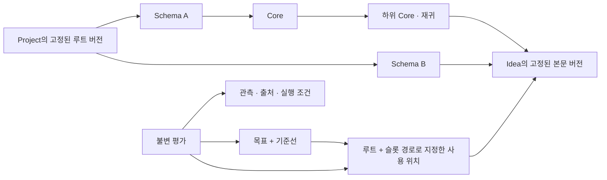

# idea_db — Neo4j 기반 아이디어 DB

상태: MCP 전용 입력·조회 전용 대시보드 전환 및 Docker 검증 완료 · 2026-09-07 · 설계 책임/통합 검증: Main(Codex)

## 목적

기획·소프트웨어·연구/모델링의 원문, 원자 아이디어, 재귀적 구성, 목표와 기준선, 실험 근거, 방향 변경 이유를 하나의 버전 그래프로 보존한다. 먼저 아이디어를 안전하게 저장하고 재사용·검증하는 DB를 완성한다. DB 자체의 저장 엔진이나 자율 에이전트 실행기를 이번에 만들지는 않는다.

이 계획은 사용자의 정의와 Fable 5.1 / Grok 4.6 검토를 통합했다. 검토 의견은 설계 근거이며 구현 검증을 대신하지 않는다.

## 저장 모델과 불변 조건

한 Idea를 여러 곳에서 쓰더라도 목표·역할·평가는 각 사용 위치의 맥락을 따른다. 화면의 깊이나 레이어가 Idea 자체의 식별자가 되지는 않는다.

1. **Project**: 논리적 최상위 범주. **Schema**: 로그인·결제·엔진 같은 업무 단위. **Core**: Core와 Idea를 재귀적으로 묶는 단위. **Idea**: 독립적으로 평가·교체·재사용할 수 있는 의미의 최소 단위. `middle`은 없으며 `core_0`, `core_1`은 화면에서 선택 경로에 따른 깊이이다.
2. Project → Schema → Core* → Idea가 기본 탐색 구조다. Schema 바로 아래 Idea도 허용한다. 미완성 원문과 후보를 저장하기 위해 빈 목표나 가짜 상위 노드를 만들지 않는다. 자식이 없다는 사실만으로 원자성 검토가 끝나지는 않는다.
3. 안정적인 응용 ID와 불변 Revision을 분리한다. 각 Revision은 정확한 자식 Revision을 슬롯으로 고정한다. CONTAINS는 다중 부모를 허용하는 비순환 그래프다. 공유 아이디어의 사용 위치는 루트 Revision과 슬롯 경로로 식별한다.
4. 한 위치의 수정은 그 경로의 조상만 새 Revision으로 복사한다. 다른 위치와 과거 스냅샷은 유지한다. 동일한 Core가 다이아몬드 형태로 여러 번 등장해도 수정 위치가 모호하지 않아야 한다. API는 대상 루트와 기대 head를 검증한다.
5. 의미 변경은 새로운 Idea와 DERIVED_FROM이다. 단순 오탈자 교정은 같은 Idea의 새 본문 Revision과 교정 사유이다. 3초→30초처럼 동작을 바꾸는 변경을 교정으로 취급하지 않는다. 분할·결합은 새 원자와 명시적 계보로 남기며 기존 근거/평가를 자동 상속하지 않는다.
6. FE/BE/Data/DB/Infra/Research/기획 등은 확장 가능한 관점/R&R 태그다. 사용 위치의 역할과 본문 주제 태그를 구별한다. 독자적인 목표·구성을 갖는 관점은 Core로 만들 수 있다. 하나의 규칙을 사용하는 FE/BE 구현은 각각의 Idea이고 APPLIES/IMPLEMENTS로 연결한다.
7. 유사도, 의존성, 파생, 지지/반박, 영향 주장을 구분한다. 영향 주장에는 범위·방향·방법/척도·추정/관측·근거를 기록한다. 유사도는 동일성이나 인과관계의 증명이 아니다.

## 목표, 기준선, 시간

- 모든 수준과 Idea의 사용 위치에 목표를 둘 수 있다. 누락된 목표는 허용하고 대시보드에서 누락으로 표시한다.
- Baseline은 채택한 목표, 기준, 제약을 고정한다. Assessment는 루트 Revision, 사용 경로, 대상 Revision, Baseline, 근거 cutoff, 평가자/평가기준 버전을 고정한다.
- 관측 원자료와 평가를 분리한다. 평가 상태는 충족/미충족/불명/분쟁/재검토이다. AI가 제안한 목표와 평가는 명시적으로 제안으로 표시하며 공식 달성도에 섞지 않는다. 모델 confidence를 완료율로 표현하지 않는다.
- 기준선이 바뀌면 새로운 평가를 만든다. 이전 판단을 덮어쓰지 않는다. 자식들의 완료가 부모 통합 목표 충족을 보장하지 않는다. 기준별 상태와 필수 gate를 표시하고 원자 수 평균을 진척률로 사용하지 않는다.
- 서버 기록 시각(recorded_at/commit sequence)과 실제 발생 시각(occurred_at)을 구분한다. 과거 조회는 effective_at과 known_at/cutoff를 함께 지정한다. 뒤늦게 기록한 사건·정정은 이전 지식 시점에 나타나면 안 된다.
- Project마다 하나의 working head와 공식 publication 이력을 둔다. 작업 중 방향 변경도 before/after, 이유, 행위자, 근거를 기록한다. 독립적인 하위 공식 스트림과 자동 브랜치 merge는 후속 범위이다.

## 입력 및 트랜잭션

원문 MCP 저장 → 로컬 구독 AI가 원자화·구조화 → MCP upload preview → 로컬 임베딩 및 유사 후보 매핑 → 클라이언트 검토 → 준비된 업로드 ID로 MCP 적용.

대시보드는 조회·검색·이력 탐색 전용이다. DB는 원문을 분할하거나 생성형 AI 추론을 수행하지 않는다. CRUD의 유일한 경로는 공식 SDK 기반 stdio MCP이며 REST 쓰기 경로는 제거한다. 입력 계약과 재시도 절차는 [mcp-intake.md](docs/mcp-intake.md)를 따른다.

- RawCapture는 이후 패키지 검증이 실패해도 보존한다. 후보는 검색 가능하지만 정식 구성이나 공식 평가로 자동 승격되지 않는다. 승격 시 원래 후보·원문의 연결을 남긴다.
- 수동 입력과 로컬 LLM/스킬은 동일한 버전형 패키지를 사용한다. 키는 클라이언트에 둔다. BYOK API를 선택하면 추론은 해당 제공자에서 실행됨을 구분한다. LLM 없이 전체 핵심 흐름을 실행할 수 있어야 한다.
- 패키지에는 프로토콜 버전, 멱등 키, 기대 head, 출처/추론 구분과 모델/스킬 출처를 포함한다. 서버가 참조·불변성·순환·출처·기준선 범위·크기·head 충돌을 검증한다. 모델에게 임의 Cypher 실행 권한을 주지 않는다.
- 같은 키/같은 본문은 같은 결과, 같은 키/다른 본문은 충돌이다. 기록·관계·결정·head를 하나의 Neo4j 트랜잭션으로 저장한다. 동시 편집은 서버 잠금과 기대 head 비교로 충돌을 감지한다. 실패한 배치의 일부가 저장되면 안 된다.
- 최초 MVP는 단일 신뢰 소유자용이다. 쓰기 직렬화와 제한된 그래프 크기로 정확성을 우선 검증한다. 이 제한은 팀 규모 성능을 입증한 것이 아니다.

## 검색과 화면

- 선택 Project/스냅샷/시간에 속하는 불변 본문을 대상으로 텍스트와 벡터 검색 결과를 순위 결합한다. MCP 업로드가 로컬 임베딩 서비스로 Idea 벡터를 생성하고 모델 digest/차원을 고정한다. MCP 하이브리드 검색은 같은 프로파일로 질의를 임베딩하며, 명시적 어휘 검색과 인덱스 커버리지를 제공한다.
- 명시적 R&R은 사용 위치에 대한 엄격한 필터다. 공유 정책처럼 관련된 노드는 별도 관련 문맥으로 표시한다. 미래 Revision/근거가 과거 검색에 새면 안 된다. 과거와 완전히 같은 검색 순위의 재현까지 보장하지 않는다.
- MVP 2D: 재귀 구성 탐색, 원문/사용 위치/계보/근거 상세, 작업/공식 버전과 시점 조회, 역할 검색, 기준별 평가 대시보드, 원문·업로드 결과 조회. 패키지 검토와 적용은 로컬 AI 클라이언트의 MCP 흐름에서 수행한다.
- 3D: X=서버 기록 시각, Y=최소 재귀 깊이, Z=Schema Entity 레이어. 실제 Revision과 구성·버전·파생·유사/모순 연결을 표시하며 회전·확대·스키마 필터·노드 선택을 지원한다. 공유 Revision의 사용 위치는 명시적으로 선택한다. 중첩 좌표는 표시만 펼치며 축 값을 유지한다. 5,000 노드·20,000 사용 위치 탐색·깊이 32 한도와 잘림을 표시한다.
- 전체 커밋 이력은 원문·실험·관측·평가를 포함한다. 3D는 프로젝트 전체 Revision 이력이며 2D는 선택한 root/지식 시점의 상세를 표시한다.

## 근거와 복구

코드 commit/경로 또는 내용 해시, 데이터·모델·환경·설정 버전, 실행 방법, 관측값, 원시 결과 참조를 기록한다. 실패·무효·미관측·부정적 결과를 구분한다. 작은 원시 내용은 캡처로 저장하고 큰 자료는 해시가 있는 외부 참조를 사용한다. 내보내기 manifest가 외부 자료를 포함했는지/별도 보관이 필요한지 명확히 표시한다.

버전형 export/import는 응용 ID, 기록 순서, 관계, head, 출처를 보존한다. Neo4j 재시작, 중단 후 재시작, 빈 DB 복원으로 검증한다. 외부 파일이 없는 것을 완전한 백업이라고 표시하지 않는다.

## 구현 산출물

- Rust API/도메인 서비스와 Neo4j Community 저장소. Python은 DBMS 런타임에 사용하지 않는다.
- Neo4j와 Rust 서비스를 함께 실행하는 독립 Docker 이미지 및 한 명령의 Compose 실행. 데이터는 볼륨에 보존한다. 외부 Neo4j에 연결하는 API 전용 이미지도 제공한다.
- 실제 API에 연결된 2D 화면. 정적 파일을 Rust 서비스에서 제공한다.
- 입력 스킬, API 계약, 재현 가능한 예제와 검증 스크립트, CI, AGENTS.md, 작업 소유권/수용 기준.
- 사용자 기존 Python 실험판은 변경하지 않는다. 개발 작업은 임시 격리 경로에서 수행하고 최종 새 저장소를 `idea_db_neo4j`에 설치한다. 저장소/제품 이름은 `idea_db`이며, 사용자의 선택에 따라 이번에는 로컬 Git 저장소만 생성한다. 원격 생성·업로드는 하지 않는다.

## 수용 시나리오

1. 로그인 정책을 FE/BE가 재사용하는 6단계 이상 Core와 다이아몬드 구성. 한 위치 수정 후 다른 위치와 과거 버전 불변.
2. 모델링 가설의 파생, 데이터/환경 출처와 실패 관측, 기준선 변경 후 새 평가. 기존 평가는 유지.
3. 비개발 기획에서 정성적 평가 기준, 누락 목표, 후보→아이디어 승격. AI 없이 실행.
4. 잘못된 참조/순환/출처/다른 멱등 본문/오래된 head 거절. 동시 동일 head 편집에서 한 건만 성공. 실패 배치의 부분 기록 없음.
5. 과거 지식 시점과 실제 발생 시점 차이, 공식 스냅샷, 역할 엄격 일치와 관련 문맥 분리, 벡터 부재 fallback.
6. 실제 Neo4j에서 export→빈 DB import 동일 식별자/의미 내용, 컨테이너 종료/재시작 후 데이터 보존, 단일 이미지 readiness와 프로세스 종료.
7. FE/BE/Infra/ML/DL/LLM 전체 기획을 두 번 크게 전환하는 30단계 lifecycle. 역할별 세 번의 실제 기술 실험과 한 번의 세부 변경, 유사 아이디어 검색, 늦은 과거 관측을 기록한다. 모든 중간 상태를 지식 시점·발생 시점으로 조회하고 재시작/복원 후 다시 검증한다. 상세 범위는 [docs/lifecycle.md](docs/lifecycle.md)를 따른다.

개발용 테스트 자료 크기와 측정값은 검증 보고서에 명시한다. 합성 소규모 테스트 통과를 팀 규모 성능·검색 품질 보장으로 해석하지 않는다. 실사용 한국어 자료의 검색 품질과 사람의 수정 비용은 후속 사용자 평가 대상이다.

## 작업 진행

| 단계 | 소유자 | 완료 조건 | 상태 |
|---|---|---|---|
| 설계 계약/하네스 | Main | plan·AGENTS·API 계약·검증 명령 | 완료 |
| Rust/Neo4j 핵심 | Opus | 불변 기록·패키지·시점·검색·복구 API와 테스트 | 구현·회귀 검증 완료 |
| 2D·3D 화면 | Terra/Sol/Main | 읽기 전용 탐색·검색·전체 이력·원문·시간/깊이/스키마 그래프 | 실제 메인 브라우저 11개 확인 통과 |
| Docker/통합 검증 | Main | 실제 단일 이미지 및 재시작·복원 테스트 | 실제 이미지·재시작·복원·종료 검증 완료 |
| 독립 수용 검토 | Sol/Main | 주요 불변 조건 검토, 발견 결함 해결 | Rust 121개·실DB 13개·MCP intake 12개 및 실제 조회 취소 회귀 통과 |
| 30단계 수명주기 | Main/Sol/Terra | 기획 전환·역할 실행·시간/검색/근거·복원 후 재조회 | MCP 입력으로 30개 체크포인트·재시작/복원 검증 통과 |

## 후속 범위

실제 팀 권한/HA, 외부 아티팩트 보관 서비스, 대규모 벡터 인덱스 최적화, 자율 에이전트 실행, 전역 의미 병합, 자동 인과 영향 전파, 사용자 저장 엔진. Neo4j를 대체할지는 실제 병목을 측정한 뒤 결정한다.

실제 검증 명령, 결과와 제한은 [docs/validation.md](docs/validation.md)에 기록했다.
